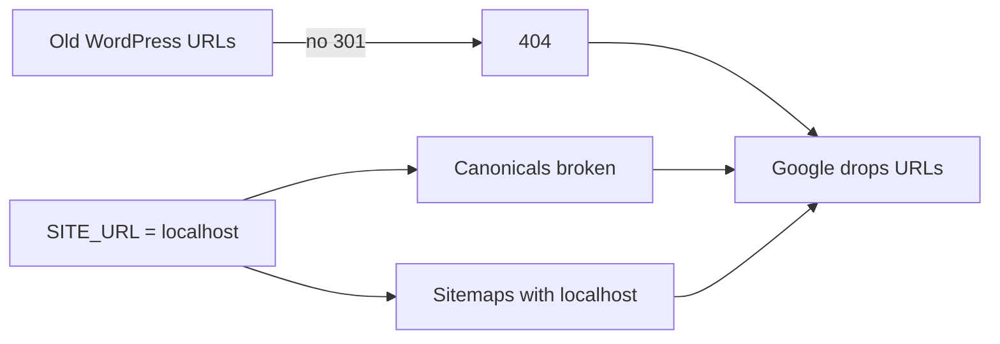

# SEO cutover (migrations & URL replacement)

Portable prevention from a WordPress + Yoast → new stack migration on Vercel (Orbitype CMS). Same failure mode applies to Astro + Orbitype clones that replace live URLs. Harden the **upstream template** and every client cutover — do not re-litigate one recovered site.

## Three defects, one root cause

| #   | Defect                          | Evidence                                                                                         | Priority            |
| --- | ------------------------------- | ------------------------------------------------------------------------------------------------ | ------------------- |
| 1   | No server-side **301** map      | Legacy URLs → hard 404; GSC “Not found”                                                          | Critical — do first |
| 2   | Broken / missing **canonicals** | `PUBLIC_SITE_URL` = localhost or preview; posts without self-canonical; slug variants of same ID | Critical            |
| 3   | Broken **sitemaps** / robots    | `robots.txt` → sitemap with `localhost` at every nested level; legacy WP sitemap still in GSC    | Critical            |

**Root cause:** Dev config (`PUBLIC_SITE_URL` / fallback → `localhost`) and no old→new redirect map reached Production, with no post-go-live indexing gate.

Google typically does **not** Manual-action the site. Content is alive under new paths; discovery fails because crawlers cannot join old URLs to new ones.



Impact pattern seen in recovery work: organic impressions down ~85%, indexed pages roughly halved, GSC 404 spike, top landing URL becomes 404, legacy `/sitemap_index.xml` 404s while the new sitemap (if any) ships localhost.

**Not** the first fix: treat as “Google penalty”, rewrite on-page SEO, or wait for content polish. First fix: permanent **301**s.

---

## Required template defaults (Astro + Orbitype)

### 1. Single `getSiteUrl()`

One helper for canonicals, OG, robots, sitemaps, JSON-LD.

- Production env: `PUBLIC_SITE_URL=https://www.client-domain.tld` (never `http://localhost:*` or `*.vercel.app` in Production). See [ENV.md](ENV.md).
- **Code fallback** = production domain of that clone, **never** `http://localhost:4321` / `:3000`.
- If `VERCEL_ENV === "production"` and URL is localhost or preview → fail build or fatal log (extend the Production URL guard in [proposed/PATCHES.md](../proposed/PATCHES.md)).

### 2. Legacy 301 map (server-side)

Permanent redirects only (never 302/307; never SPA / meta-refresh only).

Typical Astro-on-Vercel shapes:

- Astro middleware reading a typed map (`legacyRedirects.ts` + `middleware.ts`), or
- `vercel.json` / adapter `redirects` for a static map.

Rules:

- Map each productive old path → real new path (`/posts/...` or CMS page).
- No equivalent → thematically closest page, **not** mass-redirect to homepage (soft-404).
- One hop: old → final (no chains).
- Complete the map from GSC: Indexing → Pages → “Not found (404)”.
- Unit-test normalizer (trailing slash, case, query strip) + top URLs.

### 3. Canonicals + slug policy

- Home and detail pages: absolute self-referencing canonical in **SSR HTML** (verify with `curl`, not only the browser).
- Same post ID / slug variants → 301 to canonical slug **or** one canonical href to the official URL.

### 4. Sitemaps + robots

- Generate with the same `getSiteUrl()`.
- Prefer a flat, stable index (avoid nesting that reintroduces localhost).
- List only live URLs (200), not legacy 404s.
- `robots.txt`: `Sitemap:` to the correct index; drop non-standard directives GSC flags as errors (e.g. Crawl-delay) when applicable.
- Smoke: sitemap body must not contain `localhost`.

---

## Definition of Done (before “migration live”)

### Phase 0 — Inventory (before code)

- Full list of productive URLs (WP sitemap, GSC Coverage, crawl).
- Signed matrix `old_path → new_path` (or “closest page”).
- Canonical decisions: www vs apex, trailing slash, locale prefix.
- Document `PUBLIC_SITE_URL`; prod ≠ localhost.

### Phase 1 — Mandatory code in the new repo

- Middleware / `vercel.json` with full permanent map.
- Automated tests for map + path normalization.
- `getSiteUrl()` wired into canonicals, robots, sitemaps, OG; prod fallback never localhost.
- SSR canonicals on home + detail; CMS slug-canonical policy.
- Sitemaps live-only; smoke “no localhost”.

### Phase 2 — Go-live gate (blocking)

Against Production domain or production-like preview — **not** only `localhost:4321`:

- Sample 20+ legacy URLs → 301 + correct `Location`, no chains; top traffic OK.
- `grep -i localhost` on home HTML, 3 posts, sitemap index → empty.
- `robots.txt` points at a 200 sitemap.
- Vercel Production env has correct `PUBLIC_SITE_URL`.

### Phase 3 — Post-launch (24–72h, ops)

- GSC: remove dead legacy sitemap entry (e.g. `/sitemap_index.xml`).
- GSC: submit new sitemap (e.g. `/sitemap.xml` / `/sitemaps.xml`).
- GSC: “Not found (404)” → Validate Fix.
- URL Inspection → Request Indexing on top ~10 lost-traffic URLs.
- Monitor 1–4 weeks: crawl rate, indexed pages, impressions (traffic lags index).

Alert: if crawl/indexed do not move ~1 week after 301s, export GSC 404s and fill missing map rows.

---

## Verification (`curl` on Production)

```bash
# Redirects
curl -sI "https://www.example.ch/old-slug/" | grep -iE 'HTTP|Location'

# Canonical
curl -s "https://www.example.ch/" | grep -i canonical

# No localhost in sitemap
curl -s "https://www.example.ch/sitemap.xml" | grep -i localhost || echo OK
```

Checklist:

- 10+ legacy URLs → 301 + correct `Location`, no chains; top-5 traffic OK.
- Home + 3 posts: real-domain canonical; zero localhost in HTML.
- Sitemap 200; spot-check 10 listed URLs → 200.
- Slug variants → one canonical URL.

---

## Outside the repo (ops / Google / hosting)

**Before or on cutover day**

- Export indexed / top-traffic URLs (GSC, Ahrefs, Screaming Frog of the old site).
- Build and review old→new map with client/content.
- Set `PUBLIC_SITE_URL` on Vercel **Production**.
- Align DNS / canonical host (www vs apex) with redirects and canonicals.

**After Tasks 1–3 ship**

- GSC sitemap hygiene + Validate Fix + Request Indexing (Phase 3 above).

---

## Anti-patterns (do not repeat)

- Ship Production without a 301 map “because content lives at another URL”.
- Rely on client-side redirects or meta refresh.
- Leave `PUBLIC_SITE_URL=http://localhost:…` or code fallback to localhost.
- Mass-redirect everything to homepage.
- Verify only in the browser (JS-injected head) and skip `curl`.
- Submit the new sitemap without removing the old WordPress index in GSC.
- Treat the drop as a “Google penalty” and delay redirects.

---

## Minimal block for CLAUDE.md / clone runbook

```markdown
## SEO cutover (required)

- Legacy 301 map: Astro middleware or vercel.json (permanent)
- PUBLIC_SITE_URL = https://www.CLIENT-DOMAIN (Vercel Production)
- getSiteUrl() fallback = production domain (never localhost)
- curl checks: redirects, canonical, sitemaps (no localhost)
- GSC: remove old sitemap, submit new, validate 404, request indexing top URLs
```

## ADR note (port upstream)

Migrations that change URL structure are incomplete until the 301 map, Production `PUBLIC_SITE_URL`, and sitemap/canonical hygiene are verified with `curl` and GSC. Treat this as a hard gate alongside [CACHE.md](CACHE.md) post-deploy asset checks.
